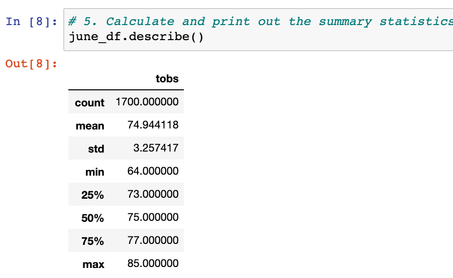
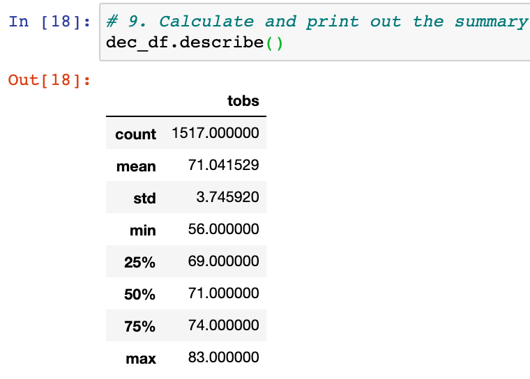

# Surfs_up

## Overview
The purpose of this analysis is to look at the temperature trends for the months of June and December to determine if a surf and ice cream shop business is sustainable year-round.

## Review
Below are the descriptive stats of each months weather trends in fahrenheit.

### June

- The average temperature is 75 degrees
- The lowest temperature recorded in this data set was 64 degrees
- The highest temperature recorded in this data set was 85 degrees

### December

- The average temperature is 71 degrees
- The lowest temperature recorded in this data set was 56 degrees
- The highest temperature recorded in this data set was 83 degrees

## Summary
Based on the results we can see a 30 degree range from the weather between June and Dec. This would allow for the weather temperature to not get in the way of the ice cream and surf business.
It would be helpful to run a query on weather trends for rain storms and percipitation.
